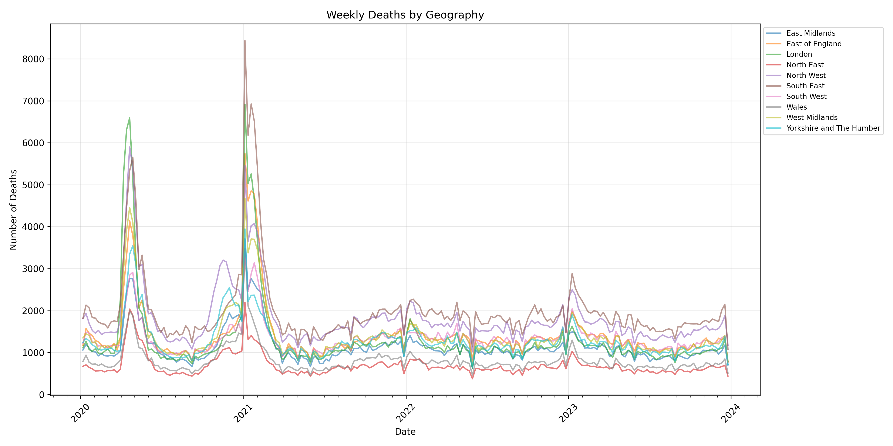
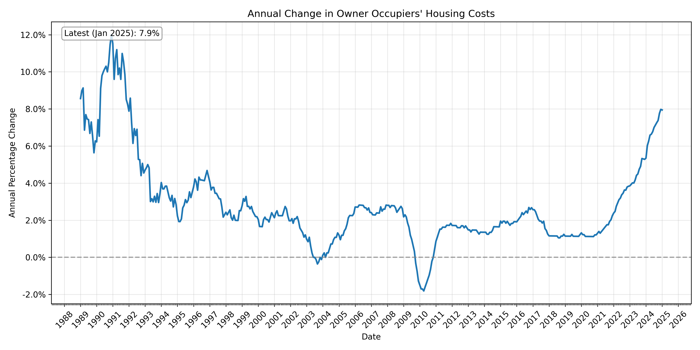
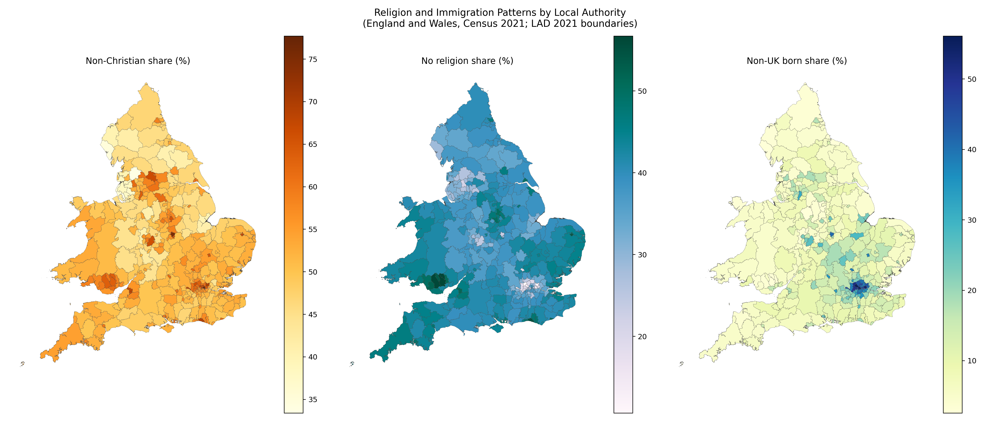

# onspy <a href='https://github.com/Joe-Wait/onspy'></a>

Python + MCP tooling for the UK Office for National Statistics (ONS) API, with
a parquet-first workflow for local analytics.

[](https://badge.fury.io/py/onspy)
[](https://pypi.org/project/onspy/)
[](https://github.com/Joe-Wait/onspy/blob/main/LICENSE)

## What onspy does

- Discover datasets, editions, dimensions, metadata, and code lists from ONS.
- Download dataset tables to pandas for lightweight exploration.
- Sync all or specific datasets to local parquet files for DuckDB analysis.
- Expose these capabilities as MCP tools for AI-driven workflows.

## Installation

```bash
pip install onspy
```

## Python quick start

```python
import onspy

# Discover datasets
datasets = onspy.list_datasets(limit=5)
print(datasets[["id", "title"]])

# Inspect one dataset
info = onspy.get_dataset_info("cpih01")
print(info["title"])

# Download latest table (auto-resolves latest edition/version)
df = onspy.download_dataset("cpih01")
print(df.head())

# Get filtered observations via dimensions
obs = onspy.get_observations(
    "cpih01",
    filters={
        "geography": "K02000001",
        "aggregate": "cpih1dim1A0",
        "time": "*",
    },
)
print(obs.head())

# Note: wildcard '*' works for table-backed datasets (with CSV download).
# API-only datasets require explicit values per dimension.
```

## MCP / CLI quick start

```bash
# Start MCP server for AI agents
onspy mcp

# Inspect available tools
onspy list-tools

# Call tools directly from CLI
onspy call-tool list_datasets --limit 10
onspy call-tool get_dataset_info --id cpih01
onspy call-tool download_dataset --id cpih01 --preview-rows 5
```

## Parquet + DuckDB workflow

Sync all datasets:

```bash
onspy call-tool download_all_parquet --output-dir ons_datasets --resume --delay 2.0
```

`manifest.json` is updated incrementally during sync so progress can be monitored.

Sync specific datasets only:

```bash
onspy call-tool download_datasets_parquet --dataset-id cpih01 --dataset-id weekly-deaths-region --output-dir ons_datasets --resume --delay 2.0
```

Analyze locally with DuckDB:

```sql
SELECT * FROM read_parquet('ons_datasets/cpih01.parquet') LIMIT 10;
SELECT count(*) AS rows FROM read_parquet('ons_datasets/*.parquet', filename=true);
```

## Core API surface

Dataset and retrieval:

- `list_datasets(limit=None)`
- `get_dataset_ids()`
- `get_dataset_info(id)`
- `get_editions(id)`
- `find_latest_version_across_editions(id)`
- `download_dataset(id, edition=None, version=None)`
- `get_dimensions(id, edition=None, version=None)`
- `get_dimension_options(id, dimension, edition=None, version=None, limit=None, offset=None)`
- `get_dimension_options_detailed(id, dimension, edition=None, version=None, limit=None, offset=None)`
- `get_observations(id, filters, edition=None, version=None)`
- `get_metadata(id, edition=None, version=None)`
- `search_dataset(id, dimension, query, edition=None, version=None)`

Code lists and links:

- `list_codelists()`
- `get_codelist_info(code_id)`
- `get_codelist_editions(code_id)`
- `get_codes(code_id, edition)`
- `get_code_info(code_id, edition, code)`
- `get_dev_url()`
- `get_qmi_url(id)`

Parquet sync:

- `download_all_parquet(output_dir="ons_datasets", resume=False, delay=2.0)`
- `download_datasets_parquet(dataset_ids, output_dir="ons_datasets", resume=False, delay=2.0)`

Boundary helpers:

- `list_boundaries()`
- `download_boundary(boundary_id, output_dir="ons_boundaries", overwrite=False)`

## Examples

The `examples` folder contains examples demonstrating basic usage and more
advanced usage, such as creating plots from datasets.








## AI Usage

Use `onspy` with AI by running the MCP server and asking natural language
questions.

1. Start MCP server: `onspy mcp`
2. Ask your AI question in normal language
3. The agent discovers relevant ONS datasets, downloads data, and analyzes it.

Example prompt:

```text
Write a report on how religion and migration are related across local authorities, explaining the key patterns and providing insightful figures.
```

## Building bots

ONS API traffic is rate limited:
https://developer.ons.gov.uk/bots/

If you run automated clients, set a clear User-Agent in
`src/onspy/client.py`.

## License

This program is free software: you can redistribute it and/or modify
it under the terms of the GPL-3.0 License - see the LICENSE file for details.
